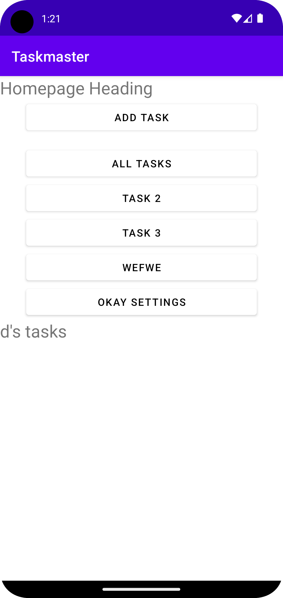

# TaskMaster - Android App

TaskMaster is a simple task management Android application that allows  
users to create and view tasks. It's a project built for practicing  
Android development, and it will be improved and expanded over the  
course of development.

## Table of Contents

1. [Features](#features)
2. [Getting Started](#getting-started)
3. [Screenshots and Changelog](#screenshots-and-change-log)
4. [Contributing](#contributing)
5. [License](#license)
6. [Change Log](#change-log)

## Features

- Users can create tasks with a title and description.
- The home screen provides a quick overview of the tasks.
- Users can navigate to an individual task screen from the main screen.

## Getting Started

1. Clone the repository

```zsh
git clone https://github.com/cfosprof/taskmaster.git  
```

2. Open the project in Android Studio.
3. Run the project on an emulator or a real device.

## Screenshots and Change Log
Screenshots of the application in action will be updated here.


### Lab 27

<details markdown="block">
  <summary>2023-05-23</summary>




Added the ability to send data among different activities in the application using SharedPreferences and Intents.
Added a Task Detail page.
Modified the Homepage page to contain three different buttons with hardcoded task titles.
Updated the documentation to reflect the changes made in today's work.


</details>

### Lab 26

<details markdown="block">
  <summary>2023-05-22</summary>  ### Lab 26


- Set up the Android project and GitHub repository.

- Built the home screen with a placeholder "my tasks" image and buttons  
  for navigation.

- Implemented the "Add a Task" screen, allowing users to input task  
  details and display a confirmation message upon submission.

- Implemented the "All Tasks" screen with a placeholder image and a back  
  button.

- Added a screenshot of the home screen to the project documentation.

- Wrote unit tests for the custom helper methods.

</details>


## Task list

### Lab 27

[x] Create a new activity for the "Settings" page.
[x] Add a SharedPreferences object and store the user's username in it.
[x] In the onCreate() method of the MainActivity, retrieve and display the user's username in a TextView.
[x] When the user taps on one of the task buttons in the MainActivity, create an Intent to start the Settings activity.
[x] When the user taps on the "Save" button, save the user's username to SharedPreferences.

Create a Task Detail page.

[ ] Create a new layout file for the Task Detail page.

[ ] In the layout file, add a TextView to display the task title.

[ ] In the layout file, add a TextView to display the task body.

[ ] Create a new activity for the Task Detail page.

[ ] In the activity's Java file, override the onCreate() method and inflate the layout file for the Task Detail page.

[ ] In the activity's Java file, get the task title and task body from Intent extras.

[ ] Set the task title and task body in the TextViews in the layout file.

Modify the Homepage page to contain three different buttons with hardcoded task titles.


[ ] In the layout file for the Homepage page, add three Buttons.

[ ] Set the text of the buttons to "Task 1", "Task 2", and "Task 3".

[ ] In the activity's Java file, override the onCreate() method and add a click listener to each of the buttons.

[ ] In the click listener for each button, create an Intent to start the Task Detail activity.

[ ] In the click listener for each button, pass the task title of the button as an Intent extra.

Update the documentation.

[ ] Update the homepage screenshot in the documentation to reflect the changes made in today's work.

[ ] Update the daily change log in the documentation to reflect the changes made in today's work.


<details markdown="block">
  <summary>2023-05-22</summary>  


## Lab 26
1. Build the Homepage
   - [x] Add a TextView to the top of the page and set its text to serve  
         as the heading of the homepage.
   - [x] Add an ImageView below the heading and set a placeholder image  to mock the “my tasks” view.
   - [x] Add two buttons at the bottom of the page. Label one button as  
         "Add Task" and the other as "All Tasks".


2. Create the Add a Task page
   - [x] In the layout file of this new activity, add EditText views for  
         users to input task title and task body.
   - [x] Add a Button view labeled as "Submit".
   - [x] In the activity's Java file, add a click listener to the  
         "Submit" button that will display a Toast message or a TextView  
         saying "Submitted!" when the button is clicked.


3. Create the All Tasks page
   - [x] Create a new activity for the "All Tasks" functionality.
   - [x] In the layout file of this activity, add an ImageView and set a  
         placeholder image.
   - [x] Add a Button view labeled as "Back". This button will navigate  
         back to the Homepage when clicked.


4. Documentation
   - [x] Create a new directory in your project root directory named  
         `screenshots`.
   - [x] Run  app on an emulator or real device, navigate to the  
         homepage, and take a screenshot.
   - [x] Save this screenshot in the `screenshots` directory.
   - [x] Add and commit this screenshot to Git repository, then  
         push the commit to GitHub.

### Actual assignment

Submission Instructions  
Work in your new taskmaster repo.  
Work on a non-master branch and make commits appropriately.  
Update your README with your changes for today and screenshot of your work.  
Create a pull request to your master branch with your work for this lab.  
Submit the link to that pull request on Canvas. Add a comment with the amount of time you spent on this assignment.  
Grading Rubric  
2 pts Android application with 3 basic pages  
2 pts Form that displays a message on the “add task” page  
1 pts Overall functionality, lack of bugs  
1 pts README with description, screenshots, and daily change log

Feature Tasks  
Homepage  
The main page should be built out to match the wireframe. In particular, it should have a heading at the top of the page, an image to mock the “my tasks” view, and buttons at the bottom of the page to allow going to the “add tasks” and “all tasks” page.

Add a Task  
On the “Add a Task” page, allow users to type in details about a new task, specifically a title and a body. When users click the “submit” button, show a “submitted!” label on the page.

All Tasks  
The all tasks page should just be an image with a back button; it needs no functionality.

Documentation  
Create a directory called screenshots in the root of your project. Take a screenshot of the homepage you’ve created. Use markdown to render the screenshot in your README.


Testing  
In a future lecture, we’ll talk about how to test Android UI using Espresso. For now, ensure that you’re writing good unit tests for anything unit-testable in your code.

### Resources

[Canvas Assignment](https://canvas.instructure.com/courses/6504881/assignments/36513376)


</details>
